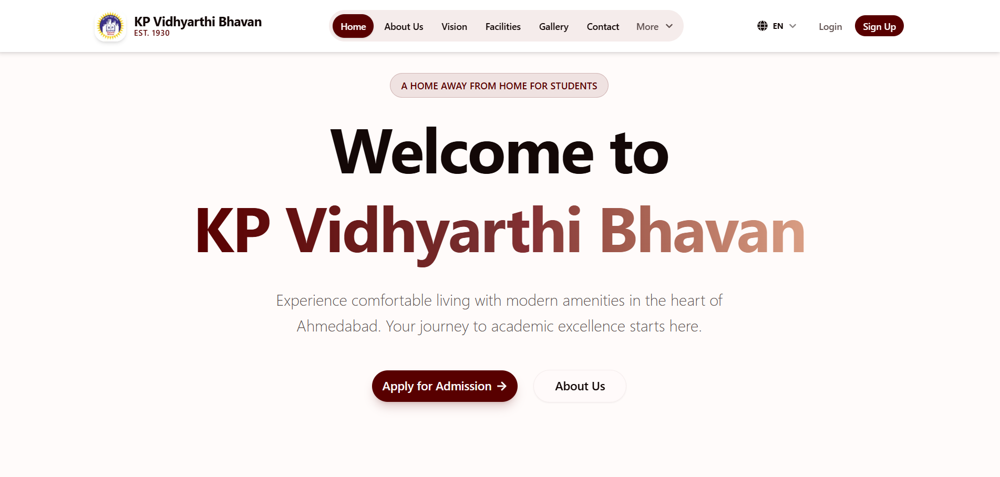

# KP Vidhyarthi Bhavan

**Live Application**: [kpbhavan.vercel.app](https://kpbhavan.vercel.app)

A modern, full-featured hostel management system built with cutting-edge web technologies. KP Vidhyarthi Bhavan streamlines hostel operations with dual-role authentication, online admission processing, room allocation, and comprehensive administrative controls.

---

## Features

### Public Website
- **Multi-language Support**: English and Gujarati with Google Fonts integration
- **Home Page**: Introduction to hostel facilities with responsive design
- **About Section**: Hostel history, mission, and vision
- **Facilities Showcase**: Detailed information about amenities and services
- **Block Information**: Visual representation of hostel blocks with capacity details
- **Rules & Regulations**: Clear guidelines for residents
- **Fee Structure**: Transparent semester-wise pricing
- **Photo Gallery**: Image showcase with Cloudinary integration
- **Announcements**: Public notices and updates
- **Contact Form**: Direct communication channel

### Student Portal
- **Secure Authentication**:
  - Credentials-based login with JWT sessions
  - Google OAuth integration
  - Password reset with email verification
  - Profile completion enforcement
  
- **Admission Management**:
  - Multi-step application form with validation
  - Passport photo upload via Cloudinary (max 5MB)
  - Real-time application tracking
  - Status notifications (submitted, under review, approved, rejected, active)
  - Application history with detailed view
  
- **Dashboard**:
  - Application statistics (total, approved, pending, rejected)
  - Room assignment details (block, room number, admission dates)
  - Recent notifications with read/unread status
  - Quick actions for profile and settings
  
- **Profile & Settings**:
  - Personal information management
  - Avatar upload and update
  - Email notification preferences
  - Account deletion with confirmation

### Admin Portal
- **Comprehensive Dashboard**:
  - Key metrics with gradient stat cards:
    - Total students count
    - Active admissions tracking
    - Pending applications counter
    - Occupancy rate with progress visualization
  - Secondary metrics:
    - Monthly revenue calculation
    - Weekly application trends
    - Approval statistics
    - Average response time
  - Recent applications list with avatars
  - Quick action shortcuts (Review, Blocks, Announcements, Payments, Analytics)
  - Real-time data refresh functionality
  
- **Application Management**:
  - Filterable application list (all, submitted, approved, rejected, active)
  - Detailed application review dialog:
    - Personal information display
    - Passport photo preview with modal
    - College and guardian details
    - Admin notes and reviewedBy tracking
  - Two-stage approval workflow:
    1. **Approve Application**: Review and mark as approved
    2. **Activate Admission**: Assign block, room, and admission dates
  - Rejection with reason tracking
  - Status badge system with Material Design icons
  - Calendar-based date selection for admission periods
  
- **Block Management**:
  - Create, update, and delete hostel blocks
  - Capacity and occupancy tracking
  - Semester-wise fee configuration
  - Block details (description, amenities, features, floor count)
  - Occupancy validation (prevent deletion if occupied)
  - Summary cards for total blocks, capacity, and occupancy
  
- **Announcements**:
  - Create and manage hostel-wide announcements
  - Rich text editor for content formatting
  - Priority levels and expiry dates
  - Target audience selection (all, students, specific blocks)
  
- **Messaging System**:
  - Broadcast notifications to students
  - Individual messaging capabilities
  - Email integration with templates
  
- **Payment Records**:
  - Fee payment tracking
  - Transaction history
  - Pending dues management

### Notification System
- **Real-time Notifications**:
  - Application status updates
  - Admission activation alerts
  - Announcement broadcasts
  - System messages
- **Email Integration**:
  - Welcome emails for new registrations
  - Application submitted confirmations
  - Approval notifications with room details
  - Admission activation emails with dates
  - Rejection notifications with feedback
  - Gmail SMTP with Nodemailer

### Security & Authentication
- **NextAuth.js v4** with JWT strategy
- Dual-role system (student/admin)
- Session-based authorization
- Protected API routes with role validation
- Password hashing and secure storage
- OAuth integration (Google)
- CSRF protection
- Email verification for password reset

---

## Tech Stack

### Frontend
- **Next.js 16**: App Router with React Server Components
- **React 19**: Latest features and concurrent rendering
- **TypeScript 5**: Type safety across the application
- **Tailwind CSS v4**: Utility-first styling with custom theme
- **shadcn/ui**: Radix UI-based component library
  - Dialog, Card, Button, Badge, Calendar, Popover, Progress
  - Alert, Select, Input, Textarea, Label, Form
  - Dropdown Menu, Sheet, Sidebar, Skeleton
- **Framer Motion**: Smooth animations and transitions
- **Google Fonts**: Noto Sans Gujarati, Anek Gujarati, Poppins

### Backend
- **Next.js API Routes**: RESTful API endpoints
- **NextAuth.js v4**: Authentication and session management
- **Drizzle ORM v0.45**: Type-safe database queries
- **Neon PostgreSQL**: Serverless Postgres database
- **Zod**: Schema validation for forms and API
- **date-fns**: Date manipulation and formatting

### External Services
- **Cloudinary v2.8**: Image upload and optimization
- **Nodemailer**: Email delivery with Gmail SMTP

### Development Tools
- **Bun**: Fast package manager and runtime
- **Drizzle Kit**: Database migration management
- **ESLint**: Code linting and quality
- **PostCSS**: CSS processing
- **TypeScript Compiler**: Type checking

---

### Authentication Flow
1. User registers via credentials or Google OAuth
2. Session created with JWT token
3. Role-based redirects (student/admin)
4. Profile completion check for students
5. Protected routes validate session and role

### Admission Workflow
1. Student submits application with photo upload
2. Application marked as "submitted"
3. Admin reviews and approves (with optional block/room assignment)
4. If offline admission needed, admin activates later
5. Activation assigns block, room, and admission dates
6. Student role granted and email notification sent
7. Student accesses room details in dashboard

**Built with modern technologies for efficient hostel management**
